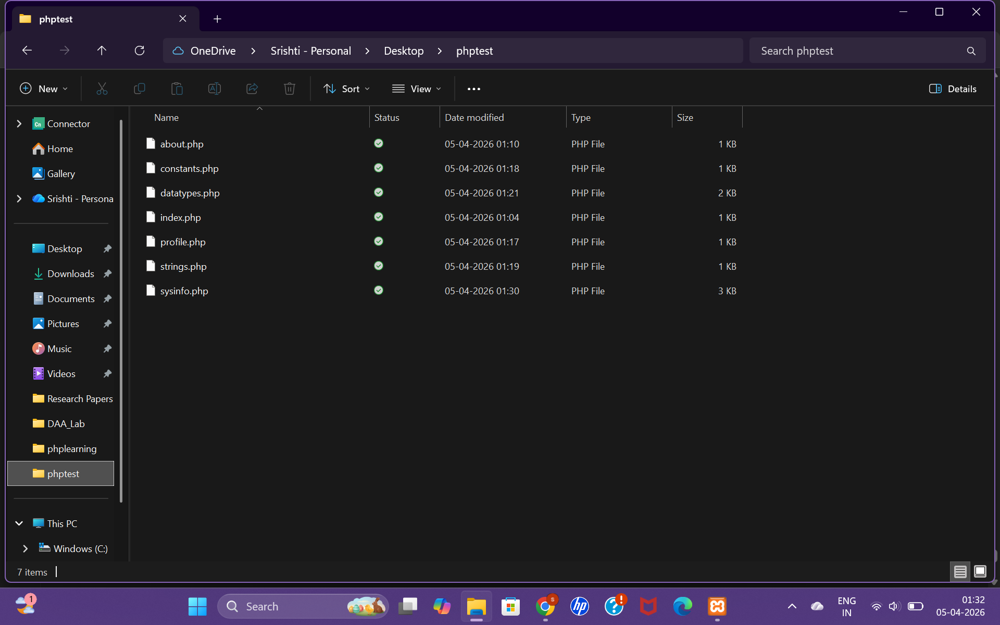

# 🧪 Experiment 08: PHP Basics & Environment Setup 💻

This experiment focuses on setting up a PHP development environment and understanding the core fundamentals of PHP through hands-on exercises. It covers everything from installation to building dynamic PHP pages using variables, constants, and server information.

---

## 🎯 Objectives

* Install and configure a PHP development environment
* Run PHP using both XAMPP and the built-in server
* Understand PHP syntax, variables, constants, and data types
* Learn debugging techniques using `var_dump()` and `print_r()`
* Explore server-side scripting and dynamic content generation

---

## 📁 Folder Structure

```
Experiment-08/
│
├── Exercise-1/
├── Exercise-2/
├── Exercise-3/
├── Exercise-4/
│
└── folder structure.png
```

---

## 🧪 Exercise 1: Install & Verify Environment

### 🔹 Description

Set up a PHP development environment using XAMPP and verify the installation.

### 🔹 Tasks Performed

* Installed XAMPP and started Apache server
* Accessed local server via `http://localhost`
* Created a PHP test file using `phpinfo()`
* Observed:

  * PHP Version
  * `php.ini` configuration file location
  * Loaded PHP extensions
* Practised security by deleting the `phpinfo()` file after use

➡️ [View Exercise 01 Files & Outputs](./Exercise 01/)

---

## 🧪 Exercise 2: Built-in PHP Server

### 🔹 Description

Learned to run PHP without XAMPP using the built-in development server.

### 🔹 Tasks Performed

* Verified PHP installation using:

  ```
  php --version
  ```
* Created a local project folder (`phptest`)
* Ran PHP server using:

  ```
  php -S localhost:8000
  ```
* Created multiple PHP files (`index.php`, `about.php`)
* Observed request logs in terminal

➡️ [View Exercise 02 Files & Outputs](./Exercise 02/)

---

## 🧪 Exercise 3: PHP Basics — Output & Variables

### 🔹 Description

Practised core PHP concepts including variables, constants, and data types.

### 🔹 Tasks Performed

* Created `profile.php` to display personal details using variables
* Used `var_dump()` for debugging
* Created `constants.php` using `define()`
* Compared single vs double-quoted strings
* Created `data_types.php` covering:

  * String, Integer, Float, Boolean, Null, Array
* Used:

  * `gettype()`
  * `is_*()` functions
* Displayed associative array using `print_r()`

➡️ [View Exercise 03 Files & Outputs](./Exercise 03/)

---

## 🧪 Exercise 4: System Info Page (Challenge)

### 🔹 Description

Built a styled PHP page displaying system and server information.

### 🔹 Features Implemented

* Displayed:

  * PHP Version (`PHP_VERSION`)
  * Operating System (`PHP_OS`)
  * Maximum Integer (`PHP_INT_MAX`)
  * Current Date & Time using `date()`
* Used `$_SERVER` superglobal to fetch:

  * Document Root
  * Script Path
* Implemented a `foreach` loop to display favourite technologies
* Styled the page using basic CSS
* Added note about PHP execution behavior

➡️ [View Exercise 04 Files & Outputs](./Exercise 04/)

---

## 📸 Project Structure



---

## 🧠 Concepts Learned

* PHP Installation and Configuration
* Running PHP with XAMPP and Built-in Server
* Variables and Constants
* Data Types and Type Checking
* Debugging Techniques (`var_dump()`, `print_r()`)
* Superglobals (`$_SERVER`)
* Date and Time Functions
* Arrays and Loops (`foreach`)
* Difference between single and double-quoted strings

---